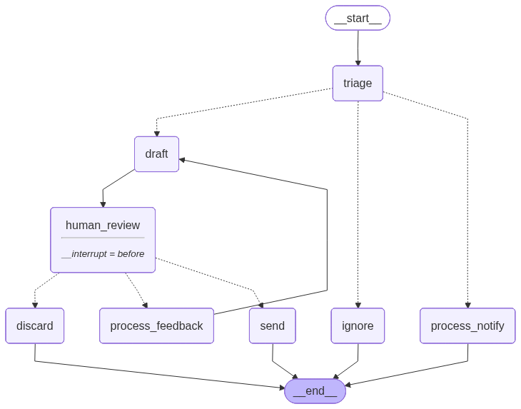

# 📧 Email Assistant Using LangGraph

An autonomous, **ambient email assistant** powered by [LangGraph](https://github.com/langchain-ai/langgraph) that proactively manages your Gmail inbox. It goes beyond simple reactive agents — it triages emails, drafts intelligent replies, checks your calendar, and learns from your feedback over time.



---

## ✨ Features

| Feature | Description |
|---|---|
| **🤖 Proactive Triage** | Automatically classifies emails as **Ignore**, **Notify**, or **Respond** |
| **✍️ Smart Drafting** | Generates context-aware reply drafts using Groq's Llama 3.3 70B |
| **📅 Calendar Awareness** | Checks Google Calendar availability before drafting meeting responses |
| **🧠 Persistent Memory** | Learns from your feedback and preferences via SQLite to personalize future responses |
| **👤 Human-in-the-Loop** | Keeps you in control — approve, edit, or reject drafts before sending |
| **🖥️ Streamlit UI** | A polished web dashboard for managing emails, reviewing drafts, and monitoring the agent |
| **📊 LangSmith Tracing** | Full observability and tracing of agent runs via LangSmith |

---

## 🏗️ Architecture

```
Email_Assistant_Using_LangGraph/
├── app.py                 # Streamlit UI application
├── main.py                # CLI entry point (CLI Based agent)
├── requirements.txt       # Python dependencies
├── src/
│   ├── auth.py            # Google OAuth2 authentication (Gmail & Calendar)
│   ├── graph.py           # LangGraph workflow (nodes, edges, state)
│   ├── graph_tools.py     # Tools bound to the LLM agent (calendar, email ops)
│   ├── agent.py           # Email triage & draft logic
│   ├── tools.py           # Gmail API utilities (fetch, search, send, draft)
│   ├── db.py              # SQLite database for memory & email tracking
│   ├── gemini.py          # Gemini LLM client
│   ├── groq_llm.py        # Groq LLM client
|   └── old_db.py          # Memory handling for CLI based agent
├── tests/                 # Test cases & dataset upload utilities
|       fix_dataset.py     # It is for handling any errors while testing using langsmith
├── evaluators/            # LLM-as-a-judge evaluation (Groq judge)
├── notebooks/             # Jupyter notebooks for prototyping
└── workflow.png           # LangGraph workflow diagram
```

### LangGraph Workflow

```
[Fetch Email] → [Triage Node] → IGNORE  → End
                               → NOTIFY  → [Process & Summarize] → End
                               → RESPOND → [Draft Agent] → [Human Review] → Approve → [Send] → End
                                                                           → Reject  → End
                                                                           → Revise  → [Draft Agent] ↩
```

---

## 🚀 Getting Started

### Prerequisites

- **Python 3.10+**
- **Conda** (recommended) or **pip**
- A **Google Cloud Project** with Gmail & Calendar APIs enabled
- API keys for **Groq** and (optionally) **Gemini**

### 1. Clone the Repository

```bash
git clone <your-repo-url>
cd Email_Assistant_Using_LangGraph
```

### 2. Create & Activate the Conda Environment

```bash
conda create -n email-agent python=3.10 -y
conda activate email-agent
```

### 3. Install Dependencies

```bash
pip install -r requirements.txt
```

### 4. Set Up Google Cloud Credentials

1. Go to the [Google Cloud Console](https://console.cloud.google.com/).
2. Create a new project (or select an existing one).
3. Enable the **Gmail API** and **Google Calendar API**.
4. Create **OAuth 2.0 Client ID** credentials (Desktop App).
5. Download the credentials JSON file and save it as:
   ```
   src/contents/credentials.json
   ```
   (!! First project may not give credentials. So make another and download JSON file).
6. On first run, a browser window will open for Google OAuth consent. After authorization, a `token.json` will be saved automatically.

### 5. Configure Environment Variables

Create a `.env` file in the project root:

```env
GROQ_API_KEY=your_groq_api_key
GEMINI_API_KEY=your_gemini_api_key          # Optional

# LangSmith (Optional - for tracing)
LANGCHAIN_API_KEY=your_langsmith_api_key
LANGSMITH_TRACING_V2=true
LANGSMITH_ENDPOINT=https://api.smith.langchain.com
LANGCHAIN_PROJECT="email-assistant"
```

> **Get your API keys:**
> - Groq → [console.groq.com](https://console.groq.com/)
> - Gemini → [aistudio.google.com](https://aistudio.google.com/)
> - LangSmith → [smith.langchain.com](https://smith.langchain.com/)

---

### 6. Folders
> - Create a folder data and files email_agent.db and checkpoints.db
> - Create a folder contents and add credentials.json file in it


## ▶️ Running the Application

### Streamlit UI (Recommended)

```bash
streamlit run app.py
```

This launches the full web dashboard where you can:
- Sync and process new emails with one click
- Review and edit AI-drafted replies
- Approve or reject drafts before sending
- View notifications, ignored emails, and sent history

### CLI Mode

```bash
python main.py
```

Fetches recent emails, triages them, and processes them directly in the terminal.

---

## 🧪 Testing & Evaluation

### LLM Evaluation

The project includes an LLM-as-a-judge evaluator using LangSmith:

```bash
python -m tests.langsmith_eval
```

---

## 🛠️ Tech Stack

| Component | Technology |
|---|---|
| Agent Framework | LangGraph, LangChain |
| LLM | Groq (Llama 3.3 70B) |
| Email & Calendar | Google APIs (Gmail v1, Calendar v3) |
| UI | Streamlit |
| Database | SQLite |
| Observability | LangSmith |
| Evaluation | LLM-as-a-Judge (Groq) |

---

## 📄 License

This project is licensed under the **MIT License** — see the [LICENSE](LICENSE) file for details.
